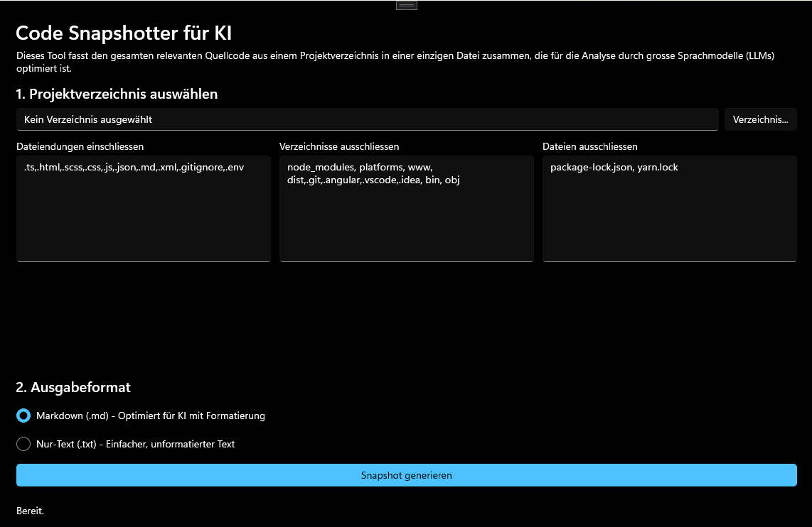

# CodeSnapshotter für KI

**A modern Windows (WinUI 3) application to consolidate source code from a project directory into a single, LLM-optimized file.**

## Description

CodeSnapshotter is a utility designed for software developers who leverage Large Language Models (LLMs) for code analysis, debugging, or documentation. It scans a project directory, intelligently filters files and folders based on user-defined rules, and aggregates the relevant source code into a single, well-structured Markdown or text file.
This solves the problem of manually copying and pasting dozens of files into an LLM, preserving the file structure context and making the AI's analysis more accurate and insightful.

## Features

-   **Intuitive UI**: A clean, modern interface built with WinUI 3.
-   **Folder Selection**: Easily pick any project directory on your system.
-   **Powerful Filtering**:
    -   Include files by extension (e.g., `.cs`, `.xaml`, `.ts`).
    -   Exclude common directories (e.g., `node_modules`, `bin`, `obj`).
    -   Exclude specific files (e.g., `package-lock.json`).
-   **Optimized Output**:
    -   **Markdown Mode**: Formats each file with a clear header and a language-specific code block for syntax highlighting.
    -   **Plain Text Mode**: Separates files with a simple, clean header.
-   **Responsive & Asynchronous**: The UI remains fully responsive while processing files in the background.

## Getting Started

### Prerequisites

-   Windows 10 version 1809 (build 17763) or later.
-  (https://dotnet.microsoft.com/en-us/download/dotnet/8.0).

### Installation

1.  Go to the(https://www.google.com/search?q=https://github.com/%3CYour-Username%3E/CodeSnapshotter/releases) page of this repository.
2.  Download the latest `.msix` installer file from the "Assets" section.
3.  Double-click the `.msix` file to install the application.

> **Note**
> You may need to trust the self-signed certificate the first time you install the application.

## Usage

1.  Launch the CodeSnapshotter application.
2.  Click **"Verzeichnis..."** to select your source code's root directory.
3.  Adjust the include/exclude filters as needed for your project.
4.  Select your desired output format (Markdown is recommended for AI).
5.  Click **"Snapshot generieren"**.
6.  Choose a location to save the final output file.

## Contributing

Contributions are welcome! If you have ideas for new features or have found a bug, please open an issue. For major changes, please open an issue first to discuss what you would like to change.

Please see the(CONTRIBUTING.md) file for more details.

## License

This project is licensed under the MIT License. See the(LICENSE) file for details.
